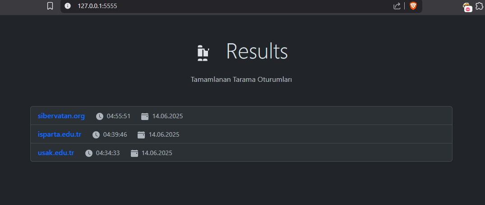
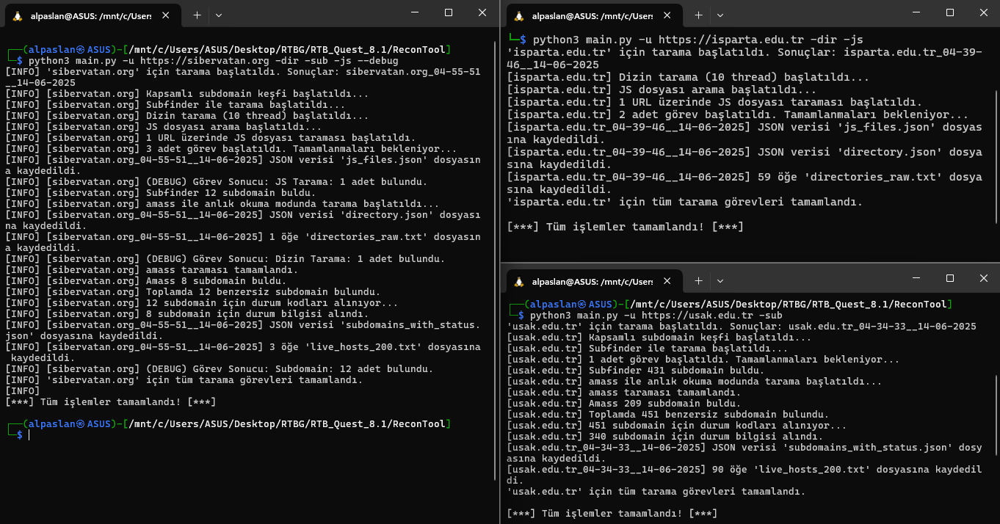

# ReconTool: OSINT & Recon Aracı

Bu araç, hedef bir domain üzerinde eş zamanlı olarak pasif ve aktif bilgi toplama işlemlerini gerçekleştiren, terminal üzerinden çalışabilen ve çıktıları şık bir web arayüzünde sunabilen bir OSINT & Recon aracıdır.

**Platform:** Araç, **Linux** ortamları (Kali, Ubuntu, Debian vb.) için tasarlanmış ve optimize edilmiştir. Windows kullanıcıları, aracı WSL (Windows Subsystem for Linux) içinde sorunsuz bir şekilde çalıştırabilir.



## 🚀 Ana Özellikler

- **Eş Zamanlı Tarama:** Subdomain, Dizin Tarama ve JS Analizi görevleri aynı anda çalışarak zamandan tasarruf sağlar.
- **Kapsamlı Subdomain Keşfi:** `subfinder` ve `amass` entegrasyonu ile en iyi sonuçları birleştirir.
- **Detaylı Sonuçlar:** `httpx` ile bulunan tüm subdomain'lerin durum kodları, başlıkları ve boyutları alınır.
- **Akıllı Sonuç Yönetimi:** Her tarama, `domain_saat__tarih` formatında ayrı bir klasörde saklanır, böylece eski taramalar kaybolmaz.
- **Modern Web Arayüzü:** `Flask` ile oluşturulmuş, koyu temalı, en yeni taramaların en üstte listelendiği, sonuçların şık tablolarda sunulduğu bir dashboard.
- **Esnek Kullanım:** Tek bir hedef (`-u`) veya bir liste dosyası (`-l`) ile tarama yapabilme.
- **Kolay Kurulum:** Tek bir `install.sh` betiği ile tüm bağımlılıkları kurma imkanı.

---

## 🛠️ Kurulum

Kurulumu otomatikleştirmek için bir `install.sh` betiği hazırlanmıştır.

**1. Projeyi İndirin:**

```bash
https://github.com/alpaslan64/Yavuzlar-Web-Guvenligi-Yazilim-Takimi-RTB-Aday-Gorevleri/tree/main/RTB_Quest_8.1/ReconTool
cd ReconTool
```

**2. Kurulum Betiğini Çalıştırın:**

Önce betiği çalıştırılabilir yapın, sonra çalıştırın. Betik, gerekli tüm bağımlılıkları (Go, subfinder, amass, httpx, Python paketleri) sizin için kuracaktır.

```bash
chmod +x install.sh
./install.sh
```
---

## 🕹️ Kullanım

**Tüm komutlar projenin ana dizininde (`ReconTool/`) çalıştırılmalıdır.**

### 1. Tarama Başlatma (`main.py`)

Ayrı bir terminalde tarama komutunuzu çalıştırın:

- **Tek Hedefte Tüm Taramalar:**
  ```bash
  python3 main.py -u https://example.com -sub -dir -js
  ```

- **Listedeki Hedefler İçin Sadece Subdomain Keşfi:**
  ```bash
  python3 main.py -l domains.txt -sub
  ```

- **Dizin Taraması İçin Düşük Thread Sayısı (Örn: 5):**
  ```bash
  python3 main.py -u https://example.com -dir -t 5
  ```

- **Detaylı Çıktı İçin Debug Modu:**
  ```bash
  python3 main.py -u https://example.com -sub --debug
  ```

### 2. Sonuçları Görüntüleme (`app.py`)

Başka bir terminalde web arayüzünü başlatın:

```bash
python3 app.py
```

Ardından web tarayıcınızı açın ve `http://127.0.0.1:5555` adresine gidin.

---

## 🧪 PoC (Proof of Concept) - Çalışma Kanıtı

Aracın çeşitli hedefler üzerinde başarılı bir şekilde çalıştığını aşağıdaki görselden görebilirsiniz.




### Oluşturulan Sonuç Dosyaları

Yukarıdaki tarama sonucunda oluşturulan sonuçlar `results/domain_.../` klasörü altında saklanmış ve GitHub'a yüklenmiştir.

---

## 📚 Kaynakça ve Kullanılan Araçlar

Bu projenin geliştirilmesinde, siber güvenlik topluluğu tarafından yaygın olarak kullanılan aşağıdaki açık kaynaklı araçlardan faydalanılmıştır.

- **[Subfinder](https://github.com/projectdiscovery/subfinder)**
- **[Amass](https://github.com/owasp-amass/amass)**
- **[HTTPX](https://github.com/projectdiscovery/httpx)**
- **[Python](https://www.python.org/)**
- **[Flask](https://flask.palletsprojects.com/)**